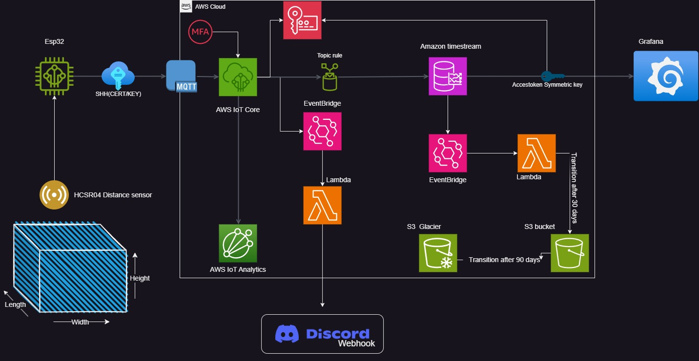

# IoT Volume Measurement System

## Overview
This project develops an IoT-based volume measurement system specifically for cuboid containers using ESP32, HC-SR04 ultrasonic sensor, and AWS IoT. It calculates and transmits the volume data of cuboid containers based on the distance measured by the HC-SR04 sensor.
## Cloud Setup Overview

*This image illustrates the overall cloud architecture on AWS, detailing how the ESP32 interacts with various AWS services.*
## Hardware Requirements
- ESP32 Development Board
- HC-SR04 Ultrasonic Sensor
- Jumper Wires
- Power Supply for ESP32

## Software Requirements
- Arduino IDE
- AWS Account and IoT Core setup
- Libraries: WiFiClientSecure, MQTTClient, ArduinoJson

## Setup and Configuration
### 1. WiFi and AWS Configuration
Update `credentials.h` with your WiFi and AWS credentials.

### 2. Hardware Connections
Connect the HC-SR04 sensor's trigger pin to GPIO 5 and echo pin to GPIO 4 of the ESP32.

### 3. AWS IoT Setup
Create a thing in AWS IoT, download certificates, and update them in the code.

### 4. Arduino IDE Setup
Open the code in Arduino IDE, select ESP32 as the board, and choose the correct COM port.

### 5. Upload the Code
Compile and upload the code to the ESP32 board.
## Operation
The device measures the distance to the liquid surface in a cuboid container and calculates the volume based on these measurements.

*This image shows the Device Shadow update process, indicating both the device state and the reported status from the MQTT test client.*

*Here is a snapshot of a Grafana dashboard displaying a timetable of distance measurements, illustrating how data visualization tools can be integrated.*

*Displayed here is the MQTT Test Client interface, showing the `distance/pub` and `liter/pub` topics in action, crucial for monitoring the data published by the device.*

*This image captures a Discord chat, automated by a Lambda function, which updates the device's status (online/offline) along with the latest measurements.*