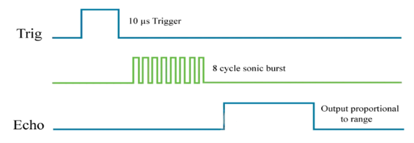

# IoT Volume Measurement System
## Table of Contents
1. [Introduction](#introduction)
2. [Cloud Setup Overview](#cloud-setup-overview)
3. [Hardware Requirements](#hardware-requirements)
4. [Software Requirements](#software-requirements)
5. [Setup and Configuration](#setup-and-configuration)
6. [Operation](#operation)
7. [Data Visualization with Grafana](#data-visualization-with-grafana)
8. [Automated Notifications with Discord](#automated-notifications-with-discord)
9. [Device Shadow](#device-shadow)
10. [AWS IoT Core](#aws-iot-core)
11. [MQTT Secure Handshake in IoT Communications](#mqtt-secure-handshake-in-iot-communications)
12. [Scalability in IoT](#scalability-in-iot)
13. [Security Considerations in Lambda Functions and Device Configuration](#security-considerations-in-lambda-functions-and-device-configuration)
14. [Introduction to Amazon Timestream and S3](#introduction-to-amazon-timestream-and-s3)
15. [Storage and Pricing Considerations](#storage-and-pricing-considerations)
16. [Principle of Least Privilege](#principle-of-least-privilege)
17. [HC-SR04 Ultrasonic Distance Sensor](#hc-sr04-ultrasonic-distance-sensor)

## Introduction
This project explores the integration of HC-SR04 ultrasonic sensors with Amazon Web Services (AWS) to create efficient and secure IoT solutions. We investigate how cloud services can enhance data collection, processing, and visualization, which are critical for modern IoT applications. The development focuses on an IoT-based volume measurement system specifically for cuboid containers. Utilizing ESP32, the HC-SR04 ultrasonic sensor, and AWS IoT, the system calculates and transmits the volume data of cuboid containers based on the distance measured by the HC-SR04 sensor. This approach aims to leverage the capabilities of AWS to ensure reliable and efficient data handling in IoT environments.

## Cloud Setup Overview

*This image illustrates the overall cloud architecture on AWS, detailing how the ESP32 interacts with various AWS services.*
## Hardware Requirements
- ESP32 Development Board
- HC-SR04 Ultrasonic Sensor
- Jumper Wires
- Power Supply for ESP32

## Software Requirements
- Arduino IDE
- AWS Account and IoT Core setup
- Libraries: WiFiClientSecure, MQTTClient, ArduinoJson

## Setup and Configuration
### 1. WiFi and AWS Configuration
Update `credentials.h` with your WiFi and AWS credentials.

### 2. Hardware Connections
Connect the HC-SR04 sensor's trigger pin to GPIO 5 and echo pin to GPIO 4 of the ESP32.

### 3. AWS IoT Setup
Create a thing in AWS IoT, download certificates, and update them in the code.

### 4. Arduino IDE Setup
Open the code in Arduino IDE, select ESP32 as the board, and choose the correct COM port.

### 5. Upload the Code
Compile and upload the code to the ESP32 board.
## Operation
The device measures the distance to the liquid surface in a cuboid container and calculates the volume based on these measurements.
## Data Visualization with Grafana
The integration of Grafana for data visualization is a crucial aspect of our IoT system. Grafana allows us to create dynamic dashboards that display real-time data, enhancing our ability to monitor and analyze the system's performance.

## Automated Notifications with Discord
To enhance the interactivity and responsiveness of our IoT system, we've integrated automated notifications through Discord. This setup, powered by an AWS Lambda function, enables the system to update the device's status (online/offline) along with the latest measurements in real-time. This feature ensures that users are promptly informed about critical updates, adding an extra layer of convenience and monitoring capability.

*This image captures a Discord chat, automated by a Lambda function, which updates the device's status (online/offline) along with the latest measurements.*

## Device Shadow
Device Shadow, also known as "Thing Shadow" in AWS IoT, is a feature that creates a virtual representation of IoT devices. This allows for remote management and configuration of devices, even when they are not constantly connected. By using Device Shadow, you can store and update settings such as dimensions for sensors monitoring rectangular prisms. This ensures that the sensors always use the latest settings, even if they temporarily lose network connectivity. Device Shadow is useful for maintaining continuity and accuracy in data collection, especially in situations where physical access to the devices is limited.
### Updating Device Shadow

To update the Device Shadow with new measurements, the state should be structured in JSON format like this:

  <pre>
    {
      "state": {
        "desired": {
          "cuboid_width": 50,
          "cuboid_length": 40,
          "cuboid_height": 300
        }
      }
    }
  </pre>

*This image shows the Device Shadow update process, indicating both the device state and the reported status from the MQTT test client.*

*Displayed here is the MQTT Test Client interface, showing the `distance/pub` and `liter/pub` topics in action, crucial for monitoring the data published by the device.*
[Back to the Top](#table-of-contents)
## AWS IoT Core
AWS IoT Core is a key component in building smart and secure IoT solutions. It simplifies device-to-cloud and device-to-device communication, handling millions of devices and a massive amount of messages simultaneously. This enables everything from small sensors to large systems to function smoothly and securely. AWS IoT Core's scalability allows businesses to easily scale up or down as needed, paying only for the resources they use, ensuring cost-effectiveness and flexibility.

## Scalability in IoT
### Scalable Infrastructure with AWS IoT Core
AWS IoT Core's ability to manage a vast number of devices and messages makes it an ideal platform for scalable IoT solutions. Whether scaling up for growing needs or scaling down during quieter periods, AWS IoT Core adapts effortlessly, ensuring seamless operation regardless of the scale.
## MQTT Secure Handshake in IoT Communications

In the IoT Volume Measurement System, the MQTT Secure Handshake is vital for ensuring secure communication between the IoT devices and AWS IoT Core. This process involves several key steps:

Firstly, TLS (Transport Layer Security) encryption is employed to secure the data transmitted to AWS IoT Core. This encryption guarantees the confidentiality and integrity of messages exchanged between devices and the cloud.

For authentication purposes, each device uses a unique certificate provided by AWS IoT Core. This ensures that only authorized devices can establish a connection. Similarly, AWS IoT Core also authenticates itself to the device, using its own certificate. This mutual authentication process is crucial for fortifying the system against unauthorized access and potential man-in-the-middle attacks, thereby maintaining a high level of security within the communication channels of the IoT system.

### Amazon Timestream for Scalable Data Management
Amazon Timestream's managed time-series database service is optimized for fast analysis of time-series data, efficiently handling scalability and maintenance. This allows for the easy management of large datasets and quick querying, perfect for IoT applications and real-time analytics.

## Security Considerations in Lambda Functions and Device Configuration
### Secrets Management for Lambda Functions
For Lambda functions, like those used to integrate with services such as Discord, sensitive information such as webhook URLs should be managed securely. Currently, these details are directly embedded in the Lambda code. A more secure approach involves using services like AWS Secrets Manager and AWS Key Management Service (KMS). These services enable secure storage and retrieval of secrets, reducing the risk of exposing sensitive information in the code.

### Secure Handling of Device Credentials
The IoT device, in this case, ESP32, uses crucial credentials for secure communication. These credentials, including Wi-Fi details and AWS IoT certificates, are stored in a separate file (`credentials.h`). In a professional or commercial environment, it's vital to store these credentials more securely. A standard practice is to embed such information in a secure element or a trusted platform module (TPM) on the device. This approach safeguards the credentials, ensuring their security even if the device is compromised.

### Using MFA for AWS IoT Core Access
Implementing Multi-factor authentication (MFA) is a crucial security step for accessing AWS IoT Core. MFA enhances security by requiring two or more verification factors, significantly reducing the risk of unauthorized access. Enabling MFA for user accounts that access AWS IoT Core is a recommended best practice for strengthening the security of the IoT system.

### IAM Roles and Policies for Access Control
IAM (Identity and Access Management) roles and policies in AWS play a critical role in managing user permissions and resource access. They ensure that only authorized users and services have access to specific AWS resources, a crucial aspect of maintaining security and efficiency in IoT systems.
## Introduction to Amazon Timestream and S3

### Amazon Timestream
Amazon Timestream, designed for time-series data management and analysis, is a cornerstone in IoT applications. It efficiently handles large data volumes and provides swift querying, perfect for real-time analytics. Paired with Grafana, Timestream enhances monitoring, analysis, and data visualization.

### Amazon S3 (Simple Storage Service)
Amazon S3, known for its versatility, offers scalable, available, secure, and high-performing object storage. It uses "buckets" to store unlimited data amounts, supporting features like backup, archiving, and application hosting. S3's adaptability is ideal for various uses, including data backup and archiving to application hosting.

### Why Timestream and S3/S3 Glacier?
THe choice to use AWS Timestream alongside S3 and S3 Glacier to optimize resource usage costs. S3 buckets are cost-effective, particularly for archiving or storing data not needing frequent access. For example, liters data dated more than a month old in Timestream may not be immediately necessary but is worth retaining
## Introduction to Amazon Timestream and S3

### Why Timestream and S3/S3 Glacier?
The decision to employ AWS Timestream alongside S3 and S3 Glacier is a strategic move to optimize resource usage costs. S3 buckets present a cost-effective solution for archiving or storing data that does not require frequent access. For instance, data such as liter measurements that are over a month old in Timestream may not be needed for immediate operations but are valuable for historical analysis and record-keeping. In such cases, transferring this older data to S3 buckets or archiving it in S3 Glacier becomes a prudent choice, balancing cost with accessibility.

This approach allows for efficient management of data lifecycle, ensuring that real-time and frequently accessed data is quickly available in Timestream, while less critical data is cost-effectively stored in S3, and archival data is securely kept in S3 Glacier. By leveraging these AWS services together, the IoT Volume Measurement System can maintain a comprehensive data repository without incurring unnecessary costs, thus optimizing the overall efficiency and effectiveness of the system.
scalability needed for IoT applications.

## Storage and Pricing Considerations

Important for understanding the cost implications of the project's storage strategy. It's important to note that pricing varies from region to region. The screenshots provided are specifically from the Frankfurt region.

*Screenshot of S3 pricing details.*

*S3-Glacier pricing.*

These screenshots provide a clear view of the pricing structure in the Frankfurt region, aiding in making informed decisions about data storage strategies.
## Principle of Least Privilege

The principle of least privilege in IT security means that a user or a program should only have the permissions that are absolutely necessary to perform its tasks. This minimizes potential security risks by limiting access and rights. It is especially important in complex environments like AWS, where incorrect permissions can lead to serious security breaches. When configuring a device or service, you start by removing all rights, then only add the rights that are necessary for the device or service to perform its intended purpose.
[Back to the Top](#table-of-contents)

## HC-SR04 Ultrasonic Distance Sensor
The HC-SR04 is a distance measuring sensor that uses ultrasound to measure the distance to an object (in this case, the surface of the water). It works by emitting an ultrasonic pulse and then measuring the time it takes for the pulse to travel to the object and reflect back.

- **Sensing Distance**: 2 - 400 cm
- **Operating Temperature**: -15°C to 70°C
- **Ultrasonic Frequency**: 40Khz

*A short pulse of at least 10 microseconds (uS) needs to be sent to the input (Trigger pin), and the sensor will then emit 8 pulses.*

### Flexibility in Measurement Settings
The system is designed for versatility in handling various container sizes. The HC-SR04 sensor's measurements can be dynamically adjusted according to different container dimensions.

- **Adjusting Measurements**: Through the Device Shadow feature in AWS IoT, the dimensions of containers (height, width, length) can be remotely updated, enhancing the system's adaptability.
- **Reference to Device Shadow**: For detailed instructions on modifying these settings, refer to the [Device Shadow](#device-shadow) section.

### Calculating Distance Using Ultrasound
The speed of sound in dry air at 20°C is 343 m/s. This can be converted to the time it takes for sound to travel a certain distance. Specifically, it takes 29,154 microseconds for sound to travel 1 cm, calculated from the given speed:
- 343 m/s = 0.0343 centimeters per microsecond.

When using the HC-SR04 ultrasonic sensor, we measure the time it takes for an ultrasonic pulse to travel to an object and then reflect back to the sensor. With this measured time, we can then calculate the distance to the object. There are two methods to do this, and both yield the same result:
1. **Distance** = (time it takes for sound to return / 2) x speed of sound
2. **Distance** = (time it takes for sound to return / 2) / 29,154

### Calculations for Container Volume
The calculated distance is used to determine the volume of liquid in a container. Adjustments to container dimensions through the Device Shadow are factored into these calculations for accurate volume measurement.

**Note**: The total height of the container must be known in advance to determine the water height.

### Rectangular Prism Dimensions
- **Height**: 300 cm
- **Width**: 50 cm
- **Length**: 40 cm

The remaining dimensions of various containers have also been predetermined as they are needed in the code.

[Back to the Top](#table-of-contents)
